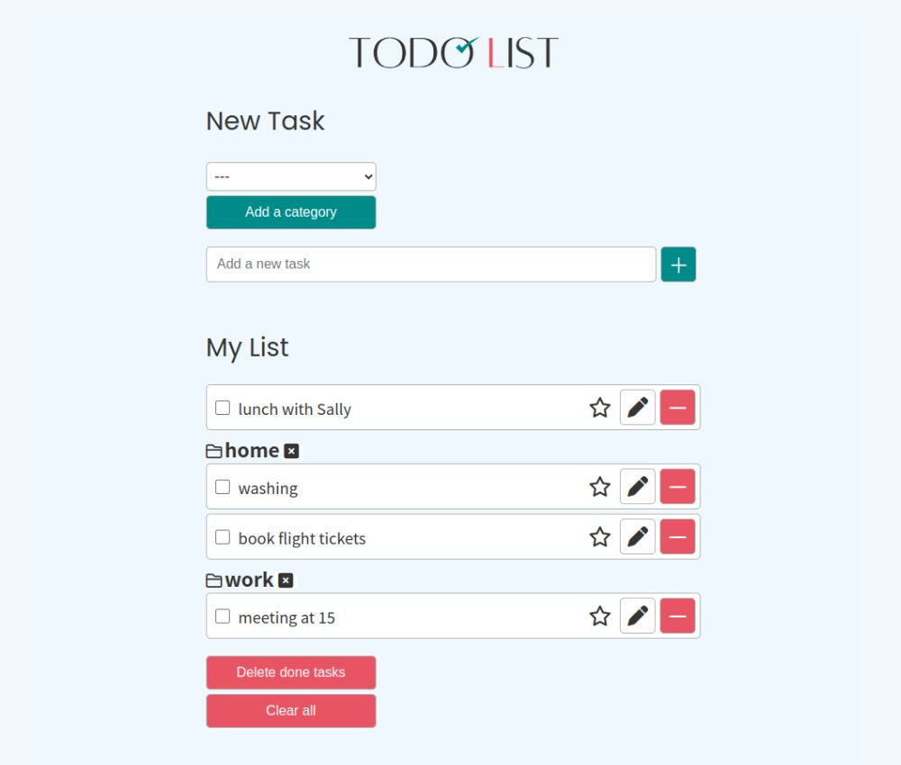

# Simple Todo List App ✅
## Mini Application with Vanilla JS and Vite

### Tools I used
  
  
  
  
  
  

## Simple Todo List with Vite
Built with Vanilla JavaScript and Vite, this Todo List project is designed to be efficient and fast, providing a seamless user experience.   

## Hosted on Vercel
The application is deployed on Vercel's robust infrastructure, ensuring consistent and dependable performance, even during high traffic periods. Additionally, Vercel's seamless scalability allows the application to effortlessly adapt to increased demand, providing users with a smooth and uninterrupted experience.

Ready to boost your productivity? Try our fast and efficient Todo List today!   
🗓 [Simple Todo List](https://todo-app-yukosuga.vercel.app/)